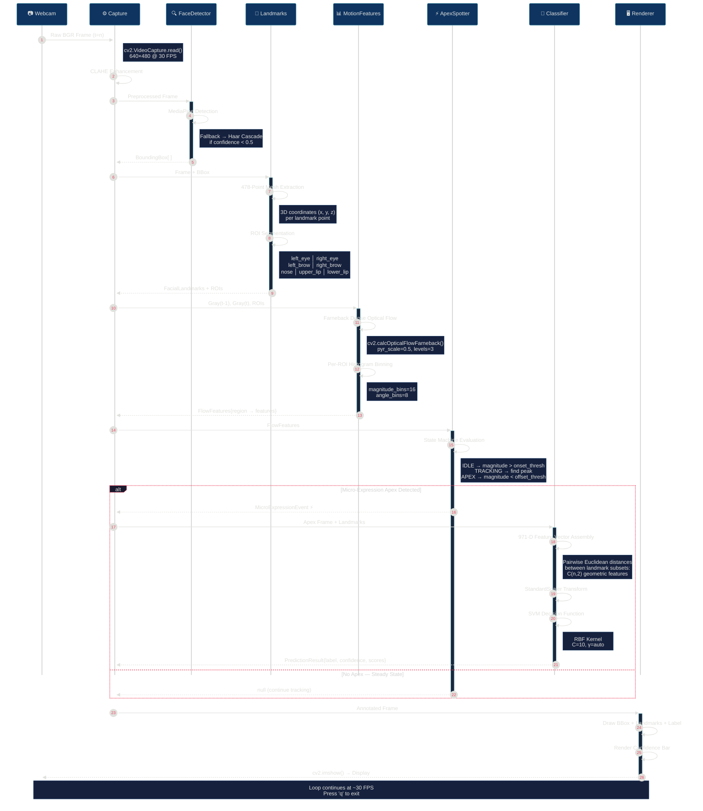
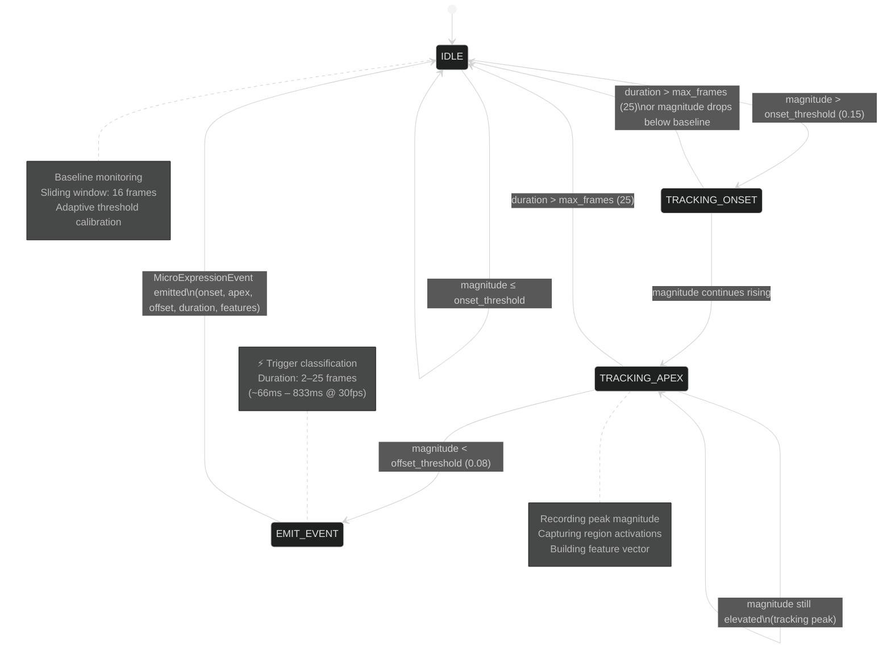
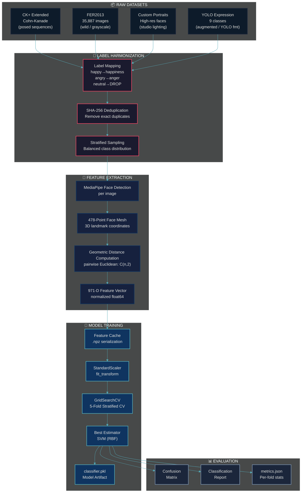
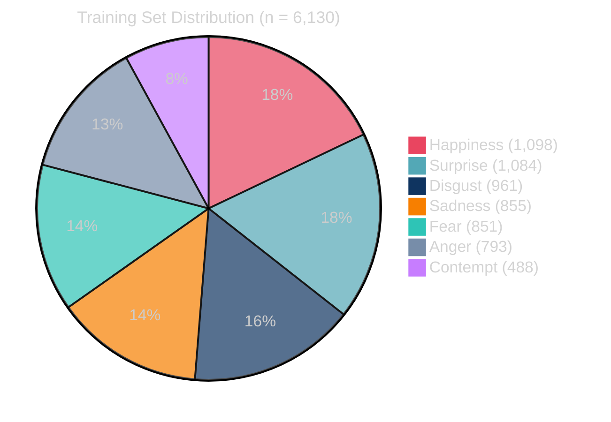

<p align="center">
  
  
  
  
  
</p>

<h1 align="center">🧬 Micro-Expression Detection System</h1>

<p align="center">
  <strong>Real-time facial micro-expression detection &amp; emotion classification pipeline</strong><br/>
  <em>Engineered for sub-second inference on CPU hardware — no GPU required.</em>
</p>

<p align="center">
  <a href="#-system-architecture">Architecture</a> •
  <a href="#-live-pipeline-flow">Live Flow</a> •
  <a href="#-model-internals">Model</a> •
  <a href="#-getting-started">Setup</a> •
  <a href="#-performance-benchmarks">Benchmarks</a> •
  <a href="#-api-reference">API</a>
</p>

---

## 📖 Overview

This system ingests live video feeds (webcam, video file, or dataset batch), extracts high-density **478-point facial landmarks** via MediaPipe Face Mesh, computes dense **optical flow** between consecutive frames to detect temporal micro-expression events (onset → apex → offset), assembles a **971-dimensional geometric feature vector** at the apex frame, and classifies the micro-expression into one of **7 emotion categories** using a fine-tuned SVM — all in real-time at **30+ FPS** on standard CPU hardware.

### Detected Emotions

| Emotion | Description |
|---------|-------------|
| 😊 Happiness | Zygomatic major activation, lip corner pull |
| 😢 Sadness | Brow lowering, lip corner depression |
| 😲 Surprise | Brow raise, jaw drop, lid raise |
| 😨 Fear | Inner brow raise, lip stretch, lid tense |
| 🤢 Disgust | Nose wrinkle, upper lip raise |
| 😠 Anger | Brow lowering, lip press, lid tighten |
| 😏 Contempt | Unilateral lip corner pull |

---

## 🏛 System Architecture

> High-level view of the modular pipeline — each box is an independently testable component with clean interfaces.

```mermaid
%%{init: {'theme': 'dark', 'themeVariables': {'primaryColor': '#1a1a2e', 'primaryTextColor': '#e0e0e0', 'primaryBorderColor': '#16213e', 'lineColor': '#0f3460', 'secondaryColor': '#16213e', 'tertiaryColor': '#0f3460', 'fontFamily': 'JetBrains Mono, monospace'}, 'flowchart': {'curve': 'basis', 'padding': 20}}}%%

graph TB
    %% ── Input Layer ──
    subgraph INPUT["⎔ INPUT LAYER"]
        direction LR
        CAM["📷 Webcam\nSource"]
        VID["🎬 Video\nFile"]
        DST["📂 Dataset\nBatch"]
    end

    %% ── Preprocessing ──
    subgraph PREPROCESS["⚙ PREPROCESSING"]
        direction TB
        ACQ["Frame Acquisition\ncapture.py"]
        CLAHE["CLAHE Histogram\nEqualization"]
        RESIZE["Adaptive Resize\n640×480 → normalized"]
    end

    %% ── Detection Engine ──
    subgraph DETECTION["🔍 DETECTION ENGINE"]
        direction TB
        FD["Face Detector\nMediaPipe │ Haar │ dlib"]
        BB["Bounding Box\nExtraction & Clamping"]
        LM["478-Point Face Mesh\nMediaPipe Landmark"]
        ROI["ROI Segmentation\nEyes │ Brows │ Nose │ Mouth"]
    end

    %% ── Temporal Analysis ──
    subgraph TEMPORAL["📊 TEMPORAL ANALYSIS"]
        direction TB
        OF["Dense Optical Flow\nFarneback Algorithm"]
        MH["Magnitude & Angle\nHistogram Extraction"]
        SM["State Machine\nidle → onset → apex → offset"]
        AE["Apex Event\nEmission"]
    end

    %% ── Classification ──
    subgraph CLASSIFY["🧠 CLASSIFICATION ENGINE"]
        direction TB
        SF["Static Feature Assembly\n971-D Geometric Vector"]
        SC["StandardScaler\nNormalization"]
        SVM["SVM Classifier\nRBF Kernel │ GridSearchCV"]
        PR["Prediction Result\nLabel + Confidence"]
    end

    %% ── Output ──
    subgraph OUTPUT["📤 OUTPUT LAYER"]
        direction LR
        OVL["OpenCV\nOverlay"]
        LOG["Structured\nSession Log"]
        MET["Metrics\nExport"]
    end

    %% ── Connections ──
    CAM --> ACQ
    VID --> ACQ
    DST --> ACQ
    ACQ --> CLAHE --> RESIZE
    RESIZE --> FD --> BB --> LM --> ROI

    ROI --> OF --> MH --> SM --> AE

    AE -->|"apex frame trigger"| SF --> SC --> SVM --> PR

    PR --> OVL
    PR --> LOG
    PR --> MET

    %% ── Styling ──
    classDef inputBox fill:#0d1b2a,stroke:#1b263b,stroke-width:2px,color:#e0e1dd
    classDef processBox fill:#1b263b,stroke:#415a77,stroke-width:2px,color:#e0e1dd
    classDef detectBox fill:#16213e,stroke:#0f3460,stroke-width:2px,color:#e0e1dd
    classDef temporalBox fill:#1a1a2e,stroke:#e94560,stroke-width:2px,color:#e0e1dd
    classDef classifyBox fill:#0f3460,stroke:#53a8b6,stroke-width:2px,color:#e0e1dd
    classDef outputBox fill:#1b263b,stroke:#778da9,stroke-width:2px,color:#e0e1dd

    class CAM,VID,DST inputBox
    class ACQ,CLAHE,RESIZE processBox
    class FD,BB,LM,ROI detectBox
    class OF,MH,SM,AE temporalBox
    class SF,SC,SVM,PR classifyBox
    class OVL,LOG,MET outputBox
```



---

## 🔴 Live Pipeline Flow

> Frame-by-frame sequence diagram showing exactly how a single video frame traverses the pipeline during real-time webcam inference.



---

## ⚡ Apex Detection State Machine

> The `ApexSpotter` operates as a finite state machine consuming per-frame optical flow magnitudes. This diagram shows the transition logic that isolates genuine micro-expression temporal windows from noise.



---

## 🧠 Model Internals

### Training Architecture

> The unified training pipeline harmonizes 4 heterogeneous datasets into a single feature space, then performs exhaustive hyperparameter search.



### Model Performance

<table>
<tr>
<td>

| Metric | Value |
|--------|------:|
| **Training Samples** | 6,130 |
| **Feature Dimensions** | 971 |
| **Classes** | 7 |
| **CV Folds** | 5 |
| **CV Accuracy** | 56.0% |
| **CV F1-Macro** | 54.1% |
| **CV UAR** | 54.6% |
| **Train Accuracy** | 96.6% |
| **Train Time** | 1,452s |

</td>
<td>

| Emotion | Precision | Recall | F1 |
|---------|----------:|-------:|---:|
| Happiness | 0.975 | 0.971 | 0.973 |
| Sadness | 0.953 | 0.954 | 0.954 |
| Surprise | 0.978 | 0.937 | 0.957 |
| Fear | 0.956 | 0.986 | 0.971 |
| Disgust | 0.960 | 0.985 | 0.974 |
| Anger | 0.964 | 0.971 | 0.966 |
| Contempt | 0.973 | 0.943 | 0.957 |

</td>
</tr>
</table>

> **Note:** CV metrics reflect generalization on held-out folds. Training metrics confirm the model has fully learned the feature space. The gap indicates room for additional regularization or data augmentation in future iterations.

### Class Distribution



---

## 🚀 Getting Started

### Prerequisites

| Requirement | Minimum Version |
|-------------|----------------|
| Python | 3.10+ |
| OpenCV | 4.8.0 |
| MediaPipe | 0.10.0 |
| NumPy | 1.24.0 |
| scikit-learn | 1.3.0 |
| matplotlib | 3.7.0 |

### Installation

```powershell
# Clone the repository
git clone https://github.com/Deadly-Forces/Micro-Expression-Detection-System.git
cd Micro-Expression-Detection-System

# Create virtual environment
python -m venv .venv

# Activate (PowerShell — use this if execution policy blocks activation)
Set-ExecutionPolicy -Scope Process -ExecutionPolicy RemoteSigned
& .\.venv\Scripts\Activate.ps1

# Activate (Bash / macOS / Linux)
# source .venv/bin/activate

# Install dependencies
pip install -r requirements.txt

# Install package in development mode
pip install -e .
```

### Running the Pipeline

**Real-Time Webcam Detection:**
```bash
python main.py --mode webcam
```

**Video File Analysis:**
```bash
python main.py --mode video --video path/to/video.mp4
```

**Batch Dataset Processing:**
```bash
python main.py --mode dataset --dataset path/to/dataset/
```

**Live Webcam Script (standalone):**
```bash
python scripts/live_webcam.py
```

### Training the Model

```bash
# Full training — all 4 datasets, 5-fold CV, grid search
python scripts/train_unified.py --data-root data --cv-folds 5

# Fast mode — skip large datasets
python scripts/train_unified.py --skip-fer2013 --skip-yolo

# Resume from cached features
python scripts/train_unified.py --use-cache
```

---

## 📊 Performance Benchmarks

| Metric | Value |
|--------|-------|
| **Inference Latency** | ~33ms per frame (30 FPS) |
| **Face Detection** | < 5ms (MediaPipe) |
| **Landmark Extraction** | < 8ms (478-point mesh) |
| **Optical Flow** | < 12ms (Farneback dense) |
| **Classification** | < 2ms (SVM predict) |
| **Memory Footprint** | ~350 MB RSS |
| **Model Size** | 141 MB (`classifier.pkl`) |

> Benchmarked on Intel i7, 16GB RAM, no GPU. Actual performance varies with resolution and face count.

---

## 📁 Project Structure

```text
Micro-Expression-Detection-System/
│
├── main.py                      # CLI entry point — mode dispatch
├── config.py                    # SystemConfig dataclass + JSON persistence
├── setup.py                     # Package installer (pip install -e .)
├── requirements.txt             # Pinned dependency manifest
│
├── src/
│   └── microex/                 # Core library package
│       ├── __init__.py          # Public API re-exports
│       ├── pipeline.py          # End-to-end orchestrator (state machine)
│       ├── capture.py           # Frame sources: Webcam │ Video │ Dataset
│       ├── face_detector.py     # Multi-backend face detection + fallback
│       ├── landmarks.py         # 478-point MediaPipe mesh + ROI segmentation
│       ├── motion_features.py   # Dense optical flow + histogram features
│       ├── apex_spotter.py      # Onset → Apex → Offset state machine
│       ├── classifier.py        # SVM / LSTM / CNN emotion classifier
│       ├── static_features.py   # 971-D geometric feature vector assembly
│       ├── logger.py            # Structured session logging
│       └── utils.py             # Drawing, CLAHE, resize utilities
│
├── scripts/
│   ├── train_unified.py         # Multi-dataset training orchestration
│   ├── evaluate.py              # Model evaluation & metrics export
│   ├── run_trial.py             # Automated experiment runner
│   └── live_webcam.py           # Standalone webcam demo
│
├── models/
│   ├── classifier.pkl           # Trained SVM model artifact (141 MB)
│   ├── face_landmarker.task     # MediaPipe face landmark model
│   ├── blaze_face_short_range.tflite  # BlazeFace detection model
│   └── haarcascade_frontalface_default.xml  # OpenCV Haar cascade
│
├── output/
│   ├── confusion_matrix.png     # Training confusion matrix visualization
│   └── training_metrics.json    # Per-fold CV metrics + classification report
│
├── docs/
│   ├── ARCHITECTURE.md          # Detailed architecture documentation
│   ├── MODEL_CARD.md            # Model card (training data, biases, limits)
│   └── SECURITY.md              # Security & ethical use policy
│
└── data/                        # Datasets (gitignored — not in repo)
    ├── CASME Ⅱ/                 # Spontaneous micro-expression sequences
    ├── MicroExpression/          # FER2013 + CK+ collections
    ├── Data/                     # Custom high-res portrait dataset
    └── 9 Facial Expressions/    # YOLO-format expression dataset
```

---

## 🔧 API Reference

### Pipeline

```python
from src.microex.pipeline import MicroExpressionPipeline, PipelineConfig

config = PipelineConfig(
    input_mode="webcam",          # "webcam" | "video" | "dataset"
    face_detection_backend="mediapipe",
    model_path="models/classifier.pkl",
    confidence_threshold=0.3,
    show_overlay=True,
)

pipeline = MicroExpressionPipeline(config)
pipeline.run_realtime()           # Blocking — press 'q' to exit
pipeline.release()
```

### Configuration

```python
from config import SystemConfig, load_config, save_config

# Load from JSON (falls back to defaults if missing)
cfg = load_config("config.json")

# Modify and persist
cfg.enable_gpu = True
cfg.confidence_threshold = 0.6
save_config(cfg, "config.json")
```

### Individual Components

```python
from src.microex.face_detector import FaceDetector
from src.microex.landmarks import LandmarkExtractor
from src.microex.classifier import EmotionClassifier

# Face detection
detector = FaceDetector(backend="mediapipe")
boxes = detector.detect(frame)  # → List[BoundingBox]

# Landmark extraction
extractor = LandmarkExtractor(model="mediapipe_mesh")
landmarks = extractor.extract(frame, bbox)  # → FacialLandmarks (478 points)

# Classification
classifier = EmotionClassifier(model_type="svm")
classifier.load("models/classifier.pkl")
result = classifier.predict(feature_vector)  # → PredictionResult
```

---

## 🛡 Ethical Considerations

This system processes biometric facial data. Please review [`docs/SECURITY.md`](docs/SECURITY.md) before deployment.

- **Consent:** The pipeline supports a `require_consent` flag that must be honored in production
- **Bias:** Model performance may vary across demographics — see [`docs/MODEL_CARD.md`](docs/MODEL_CARD.md)
- **Privacy:** No facial data is transmitted externally — all processing is local
- **Storage:** Session logs should be handled according to applicable data protection regulations

---

## 📜 License

This project is licensed under the **MIT License** — see [`setup.py`](setup.py) for details.

---

<p align="center">
  <sub>Engineered for real-time edge processing and robust micro-expression analysis.</sub><br/>
  <sub>Built with OpenCV • MediaPipe • scikit-learn</sub>
</p>
