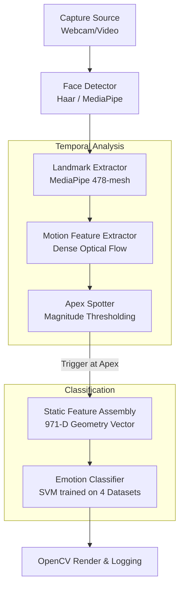

# Micro-Expression Detection System

A high-performance, modular Python pipeline for real-time facial micro-expression detection and classification. 

This system ingests video feeds (via webcam or video files), extracts high-density 478-point facial landmarks, calculates structural geometry, detects temporal micro-expression apexes using optical flow, and classifies emotions in real-time using a fine-tuned Support Vector Machine (SVM).

---

## 🏗️ Architecture

The system is built on a highly modular, decoupled architecture enabling real-time performance (30+ FPS) on standard CPU hardware. 



### Core Components
1. **Face Detection (`face_detector.py`)**: Locates the face in the frame using configurable backends (MediaPipe, Haar).
2. **Landmark Extraction (`landmarks.py`)**: Generates a dense 478-point 3D face mesh.
3. **Motion Extraction & Apex Spotting (`motion_features.py` / `apex_spotter.py`)**: Tracks dense optical flow between frames to detect sudden, subtle facial movements, isolating the onset, apex (peak intensity), and offset of a micro-expression.
4. **Feature Assembly (`static_features.py`)**: Calculates a 971-D geometric distance vector spanning eyes, brows, nose, and mouth strictly at the spotted apex frame.
5. **Classification (`classifier.py`)**: A GridSearchCV-tuned SVM predicts the micro-expression (Anger, Contempt, Disgust, Fear, Happiness, Sadness, Surprise) based on the 971-D vector.

---

## 🧠 Model & Datasets

The classification model is built for robustness across diverse real-world lighting and facial structures. It was trained using a custom `train_unified.py` pipeline that seamlessly merges 4 distinct facial expression datasets:
- **CK+ (Extended Cohn-Kanade)**
- **FER2013**
- **Custom High-Res Portraits**
- **YOLO Facial Expression Dataset**

The training pipeline implements dataset label harmonization, bounded stratified sampling, and a computationally intensive 5-fold cross-validated grid search across ~7,500 real-world samples.

---

## 🚀 Getting Started

### Prerequisites
- Python 3.8+
- Requirements specified in `requirements.txt`

```bash
# Clone the repository
git clone https://github.com/Deadly-Forces/Micro-Expression-Detection-System.git
cd Micro-Expression-Detection-System

# Create and activate a virtual environment
python -m venv .venv
source .venv/bin/activate  # On Windows: .venv\Scripts\activate

# Install dependencies
pip install -r requirements.txt
```

### Running the Pipeline

**Real-Time Webcam Mode:**
```bash
python main.py --mode webcam
```

**Video Processing Mode:**
```bash
python main.py --mode video --video path/to/your/video.mp4
```

**Batch Dataset Mode:**
```bash
python main.py --mode dataset --dataset path/to/dataset/
```

### Training the Model

If you wish to re-train the model with your own data, place your datasets in the `data/` directory matching the internal loaders and run:

```bash
python scripts/train_unified.py --data-root data --cv-folds 5
```

---

## 📁 Directory Structure

```text
Micro-Expression-Detection-System/
├── config.py             # System configuration parameters
├── main.py               # E2E pipeline entry point
├── requirements.txt      # Dependency manifest
├── scripts/
│   ├── train_unified.py  # 4-dataset SVM training orchestration
│   └── evaluate.py       # Model evaluation utilities
└── src/
    └── microex/
        ├── apex_spotter.py      # Flow-magnitude apex detection
        ├── capture.py           # Multi-modal stream ingestion
        ├── classifier.py        # SVM inference wrapper
        ├── face_detector.py     # Bounding box extraction
        ├── landmarks.py         # MediaPipe 478-mesh generation
        ├── logger.py            # Structured session logging
        ├── motion_features.py   # Optical flow computation
        ├── pipeline.py          # State-machine orchestration
        ├── static_features.py   # 971-D geometric vector math
        └── utils.py             # Rendering helpers
```

---

*Engineered for real-time edge processing and robust micro-expression analysis.*
